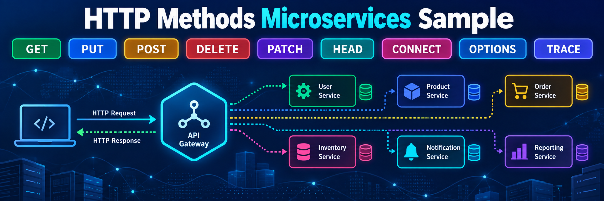

# HTTP Methods Sample

[](https://ci.appveyor.com/project/Mahadenamuththa/http-methods-sample)


A .NET 10 LTS microservices sample that demonstrates how HTTP methods are used in ASP.NET Core Minimal APIs.

## Table of Contents

- [What the Banner Shows](#what-the-banner-shows)
- [Microservices](#microservices)
- [Solution Structure](#solution-structure)
- [Requirements](#requirements)
- [Build and Test](#build-and-test)
- [Run the APIs](#run-the-apis)
- [How Requests Flow](#how-requests-flow)
- [HTTP Method Flow Image](#http-method-flow-image)
- [Method-Specific Flow Diagrams](#method-specific-flow-diagrams)
- [HTTP Method Guide](#http-method-guide)
- [Method Summary](#method-summary)

## What the Banner Shows

The banner is a visual overview of how an HTTP request travels through a microservice system:

| Banner element | Meaning in this project |
| --- | --- |
| HTTP method chips | The sample demonstrates `GET`, `PUT`, `POST`, `DELETE`, `PATCH`, `HEAD`, `CONNECT`, `OPTIONS`, and `TRACE`. |
| Client/laptop | A caller such as `curl`, a browser, a frontend app, or another service. |
| HTTP request arrow | The incoming API call that carries a method, route, headers, and optional body. |
| API gateway shape | The ASP.NET Core API host where routes are mapped. |
| Service boxes | Microservice boundaries such as Inventory and Diagnostics. |
| Database icons | Infrastructure or persistence. This sample uses in-memory storage for simplicity. |
| HTTP response arrow | The response status, headers, and optional body returned to the caller. |

## Microservices

| Microservice | Responsibility | Methods demonstrated |
| --- | --- | --- |
| `Inventory.Api` | CRUD-style resource operations for inventory items. | `GET`, `POST`, `PUT`, `PATCH`, `DELETE`, `HEAD`, `OPTIONS` |
| `Diagnostics.Api` | Protocol and diagnostic method examples. | `GET`, `OPTIONS`, `TRACE`, `CONNECT` |

## Solution Structure

The sample uses separate projects to show a simple microservice layering style.

```text
services/
  inventory-service/
    src/
      Inventory.Api/
      Inventory.Application/
      Inventory.Domain/
      Inventory.DTOs/
      Inventory.Infrastructure/
    tests/
      Inventory.Tests/

  diagnostics-service/
    src/
      Diagnostics.Api/
      Diagnostics.Application/
      Diagnostics.Domain/
      Diagnostics.DTOs/
      Diagnostics.Infrastructure/
    tests/
      Diagnostics.Tests/
```

Dependency direction:

```text
API -> Application -> Infrastructure
API -> DTOs
Application -> DTOs
Infrastructure -> DTOs
```

## Requirements

- .NET 10 SDK

```bash
dotnet --info
```

## Build and Test

```bash
dotnet restore HttpMethodsSample.slnx
dotnet build HttpMethodsSample.slnx --configuration Release --no-restore
dotnet test services/inventory-service/tests/Inventory.Tests/Inventory.Tests.csproj --configuration Release --no-restore
dotnet test services/diagnostics-service/tests/Diagnostics.Tests/Diagnostics.Tests.csproj --configuration Release --no-restore
```

`Directory.Build.props` disables NuGet audit network calls so the sample builds cleanly in offline or restricted CI environments.

## Run the APIs

Start the Inventory API:

```bash
dotnet run --project services/inventory-service/src/Inventory.Api --urls http://localhost:5001
```

Start the Diagnostics API:

```bash
dotnet run --project services/diagnostics-service/src/Diagnostics.Api --urls http://localhost:5002
```

## How Requests Flow

Each API call follows the same shape shown in the banner.

```text
Client
  -> HTTP method + route + headers + optional body
  -> *.Api project
  -> Api/*Endpoints.cs maps the route
  -> Api/*Handlers.cs handles HTTP details
  -> Application/*Service.cs runs the use case
  -> Infrastructure, when storage is needed
  -> HTTP status + headers + optional body
  -> Client
```

Example from the Inventory API:

```csharp
builder.Services.AddInventorySample();

var app = builder.Build();

app.MapInventoryEndpoints();
```

## HTTP Method Flow Image

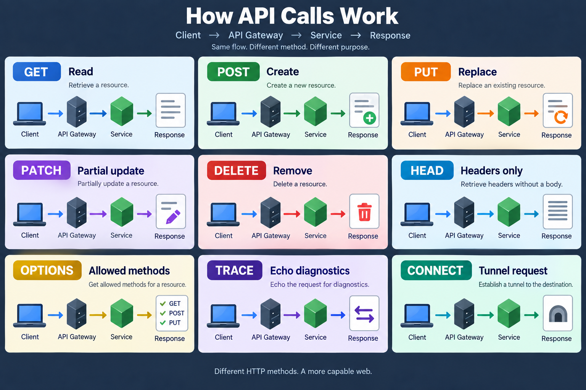

The image shows that every HTTP method follows the same high-level API path:

```text
Client -> API Gateway / API Host -> Application Service -> Response
```

The method changes the intent of the request:

| Method | Image meaning | API call behavior |
| --- | --- | --- |
| `GET` | Read | Client asks the API to retrieve a resource. |
| `POST` | Create | Client sends a body so the service can create a new resource. |
| `PUT` | Replace | Client sends a full representation to replace or upsert a known resource. |
| `PATCH` | Partial update | Client sends only the fields that should change. |
| `DELETE` | Remove | Client asks the service to delete the resource at the URI. |
| `HEAD` | Headers only | Client asks for metadata without receiving the response body. |
| `OPTIONS` | Allowed methods | Client asks which methods the endpoint supports. |
| `TRACE` | Echo diagnostics | Client asks the diagnostics service to echo sanitized request metadata. |
| `CONNECT` | Tunnel request | Client asks for a proxy-style tunnel; this sample returns a safe demo response. |

## Method-Specific Flow Diagrams

These diagrams show the request and response journey for each HTTP method demonstrated by the sample APIs.

### GET Flow

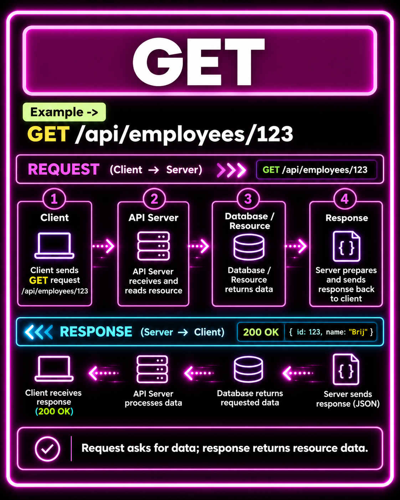

### POST Flow

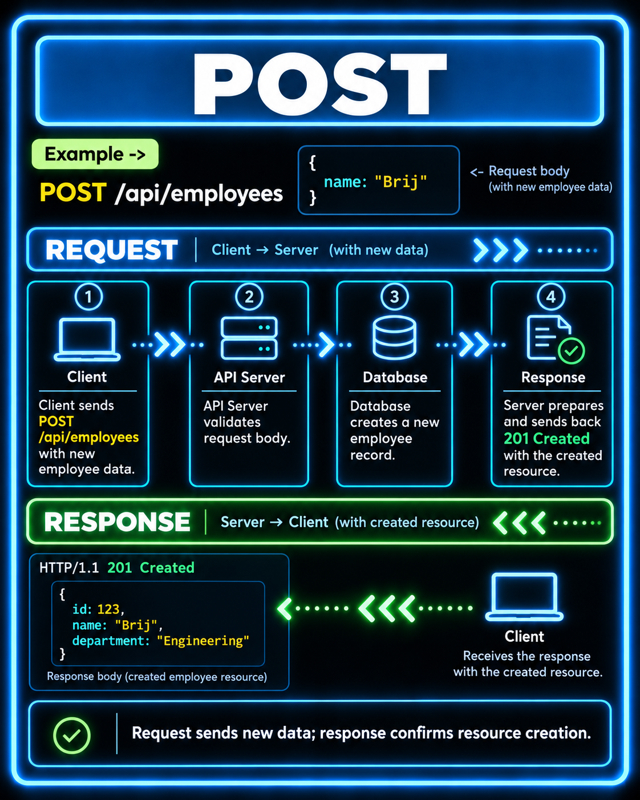

### PUT Flow

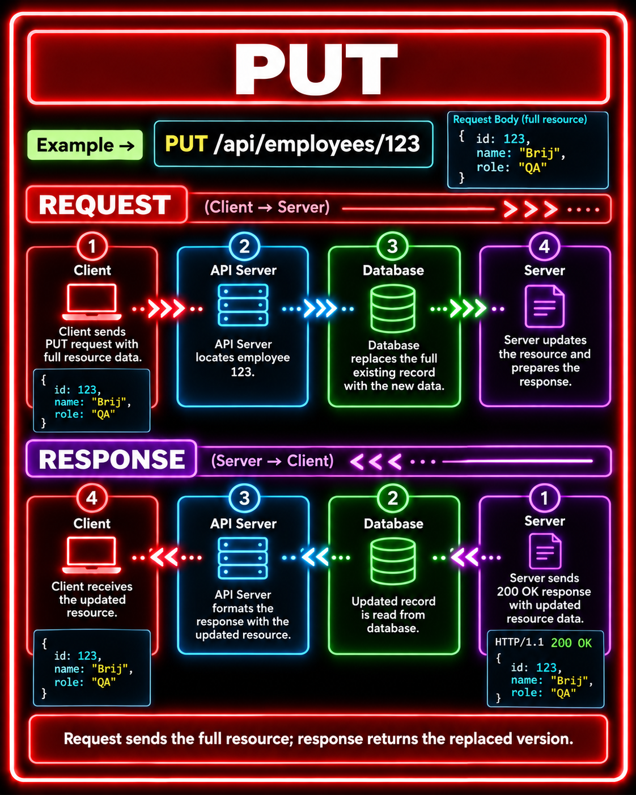

### PATCH Flow

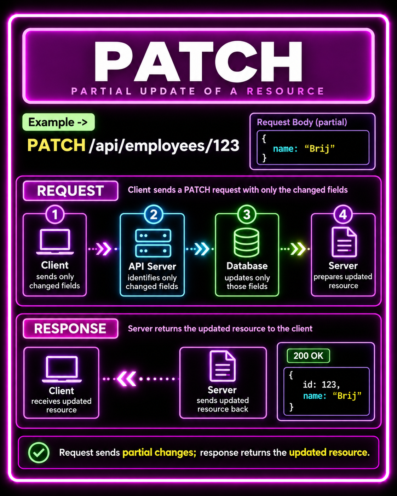

### DELETE Flow

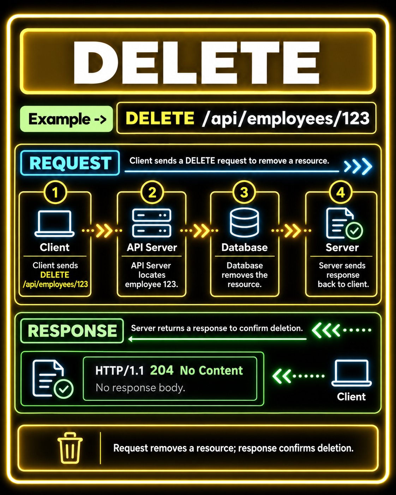

### HEAD Flow

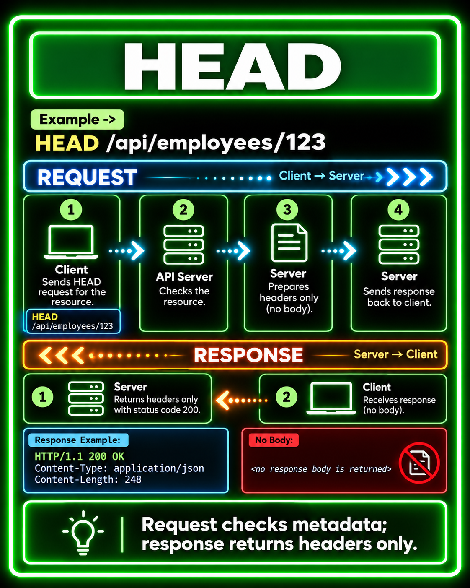

### OPTIONS Flow

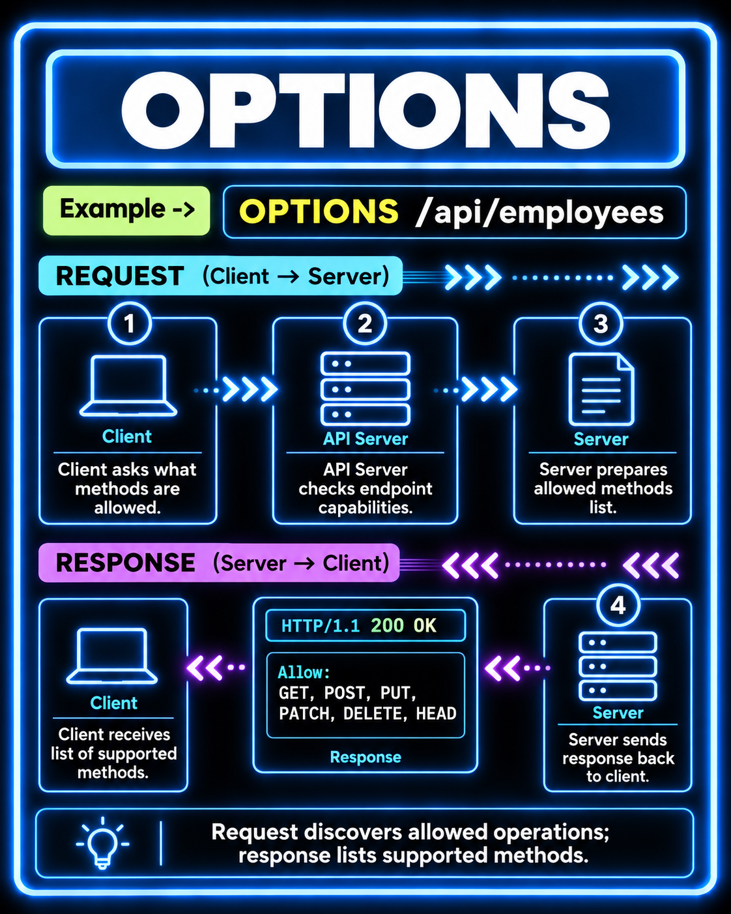

### TRACE Flow

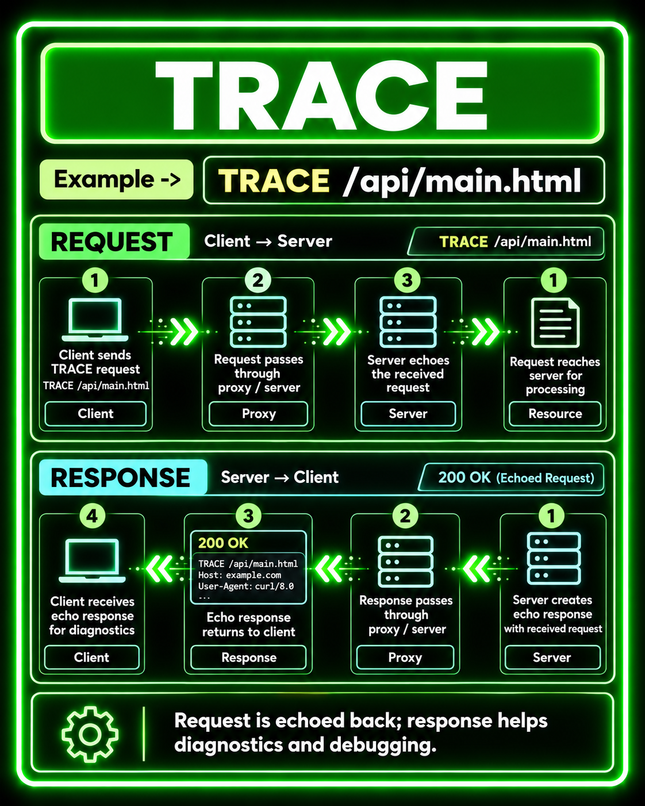

### CONNECT Flow

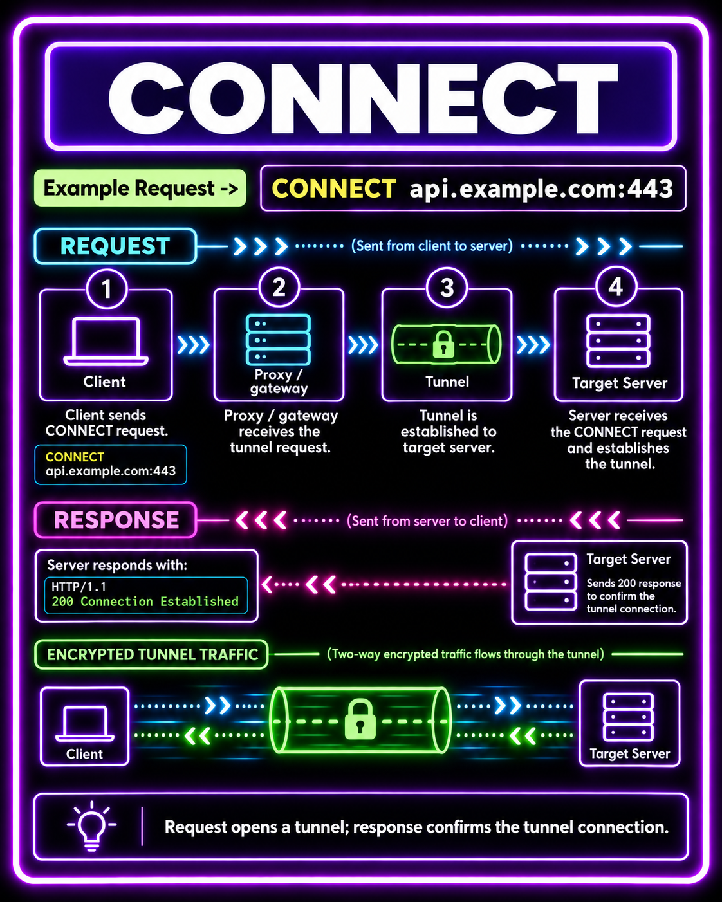

## HTTP Method Guide

### GET

Use `GET` to read a resource without changing server state.

| Item | Details |
| --- | --- |
| Sample endpoints | `GET /inventory`, `GET /inventory/{id}` |
| Request body | No |
| Successful response | `200 OK` with JSON |
| Common use | Lists, detail pages, lookups |

```bash
curl http://localhost:5001/inventory
curl http://localhost:5001/inventory/1
```

### POST

Use `POST` when the server should create a resource or process a command.

| Item | Details |
| --- | --- |
| Sample endpoint | `POST /inventory` |
| Request body | JSON item input |
| Successful response | `201 Created` with `Location` header |
| Common use | Create resources, submit commands |

```bash
curl -i -X POST http://localhost:5001/inventory \
  -H "Content-Type: application/json" \
  -d "{\"name\":\"Pencil\",\"quantity\":30}"
```

### PUT

Use `PUT` to fully replace a resource at a known URI.

| Item | Details |
| --- | --- |
| Sample endpoint | `PUT /inventory/{id}` |
| Request body | Full JSON replacement |
| Successful response | `200 OK` with updated JSON |
| Common use | Replace or upsert a known resource |

```bash
curl -i -X PUT http://localhost:5001/inventory/1 \
  -H "Content-Type: application/json" \
  -d "{\"name\":\"Marker\",\"quantity\":7}"
```

### PATCH

Use `PATCH` to update only part of a resource.

| Item | Details |
| --- | --- |
| Sample endpoint | `PATCH /inventory/{id}` |
| Request body | Partial JSON update |
| Successful response | `200 OK` with updated JSON |
| Common use | Edit one or two fields without replacing the whole resource |

```bash
curl -i -X PATCH http://localhost:5001/inventory/1 \
  -H "Content-Type: application/json" \
  -d "{\"quantity\":25}"
```

### DELETE

Use `DELETE` to remove a resource.

| Item | Details |
| --- | --- |
| Sample endpoint | `DELETE /inventory/{id}` |
| Request body | No |
| Successful response | `204 No Content` |
| Common use | Remove a resource by URI |

```bash
curl -i -X DELETE http://localhost:5001/inventory/1
```

### HEAD

Use `HEAD` to get the same headers as `GET` without downloading the body.

| Item | Details |
| --- | --- |
| Sample endpoint | `HEAD /inventory/{id}` |
| Request body | No |
| Successful response | `200 OK` with headers only |
| Common use | Metadata, existence checks, cache validation |

```bash
curl -I http://localhost:5001/inventory/1
```

### OPTIONS

Use `OPTIONS` to discover which methods an endpoint supports.

| Item | Details |
| --- | --- |
| Sample endpoints | `OPTIONS /inventory`, `OPTIONS /inventory/{id}`, `OPTIONS /diagnostics` |
| Request body | No |
| Successful response | `204 No Content` with `Allow` header |
| Common use | Capability discovery, CORS/preflight style checks |

```bash
curl -i -X OPTIONS http://localhost:5001/inventory
curl -i -X OPTIONS http://localhost:5001/inventory/1
curl -i -X OPTIONS http://localhost:5002/diagnostics
```

### TRACE

Use `TRACE` for diagnostics because it echoes request metadata. Many production systems disable it for security reasons.

| Item | Details |
| --- | --- |
| Sample endpoint | `TRACE /diagnostics/trace` |
| Request body | Not needed |
| Successful response | `200 OK` with sanitized echo JSON |
| Common use | Debug request routing and headers |

```bash
curl -i -X TRACE "http://localhost:5002/diagnostics/trace?demo=true" \
  -H "Authorization: Bearer secret" \
  -H "X-Demo: visible"
```

The sample redacts sensitive headers such as `Authorization`, `Cookie`, and `Proxy-Authorization`.

### CONNECT

Use `CONNECT` when an HTTP proxy needs to open a tunnel to another server, commonly for HTTPS proxying.

| Item | Details |
| --- | --- |
| Sample endpoint | `CONNECT /diagnostics/connect/{authority}` |
| Request body | No |
| Successful response | `200 OK` demo response |
| Common use | Proxy tunneling |

```bash
curl -i -X CONNECT http://localhost:5002/diagnostics/connect/example.com:443
```

Some local clients and servers apply special `CONNECT` handling before normal routing. For day-to-day testing and CI, this sample exposes the same safe demo response through `POST` while still mapping the real `CONNECT` method.

```bash
curl -i -X POST http://localhost:5002/diagnostics/connect/example.com:443
```

## Method Summary

| Method | Safe by convention | Idempotent by convention | Request body usually used | This sample demonstrates |
| --- | --- | --- | --- | --- |
| `GET` | Yes | Yes | No | Reading inventory resources |
| `POST` | No | No | Yes | Creating inventory resources |
| `PUT` | No | Yes | Yes | Replacing/upserting inventory resources |
| `PATCH` | No | Usually no | Yes | Partially updating inventory resources |
| `DELETE` | No | Yes | No | Removing inventory resources |
| `HEAD` | Yes | Yes | No | Reading headers without a body |
| `OPTIONS` | Yes | Yes | No | Returning supported methods with `Allow` |
| `TRACE` | Yes | Yes | Usually no | Echoing sanitized request metadata |
| `CONNECT` | No | No | No | Demonstrating a safe proxy tunnel acknowledgement |
